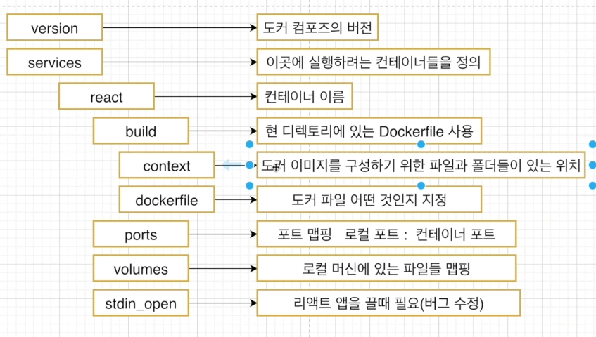
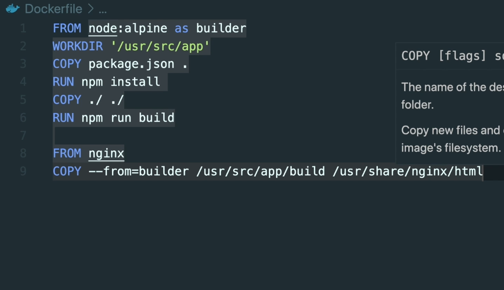

# 도커 기본

## 명령어
* docker run
  * 도커 실행
* docker stop
  * 도커 컨테이너 중지(Graceful)
* docker kill
  * 도커 컨테이너 중지(Immediately)
* docker rm
  * 도커 컨테이너 삭제
* docker rm 'docker ps -a -q'
  * 도커 컨테이너 전체 삭제
* docker rmi
  * 도커 이미지 삭제
* docker exec <컨테이너 아이디> <명령어>
  * 실행중인 도커 컨테이너에 명령어 전달
* docker exec -it <컨테이너 아이디> <명령어>
  * -i : interactive(상호적인)
  * -t : terminal
  * -it가 없으면 명령어를 실행만 하고 컨테이너 바깥으로 빠져나옴.
* docker exec -it <컨테이너 아이디> <sh>
  * 도커 컨테이너 내부 쉘로 들어 감.
  * Crtl + D 빠져나오기

## 도커 이미지 생성 순서
1. Docker File 작성
   * Docker Image를 만들기 위한 설정 파일
   * 컨테이너가 어떻게 행동해야 하는지 설정 정의
2. 도커 클라이언트
   * 도커 파일이 도커 클라이언트에 전달되어야 함
3. 도커 서버
   * 도커 클라이언트에 전달된 작업들을 진행
4. 이미지 생성

## 도커 파일 만들기
1. 베이스 이미지 명시
   * 도커 이미지는 여러개의 레이어로 구성
   * 레이어들 + 베이스 이미지(OS)
   * 이미지에 무엇인가 추가하는 경우 레이어가 추가
2. 추가적 파일을 다운 받기 위한 명령어 명시
   * 
3. 컨테이너 시작 시 실행 될 명령어 명시

### 추가적으로 필요한 파일들을 다운
#### 도커 이미지가 생성되기 전에 수행할 쉘 명령어
RUN command

### 컨테이너 시작 시 실행 될 명령어
#### 실행 파일 또는 쉘 스크립트. DockerFile 내 1회만 사용
CMD [ "executable" ]

* 도커 파일에 입력된 것들이 도커 클라이언트에 전달되어서 도커 서버가 인식하게 하여야 함
  * docker build ./ 
  * docker build .
  * Build 명령어는 해당 디렉토리 내에서 dockerfile을 찾아서 도커 클라이언트어 전달
  * 베이스 이미지에서 다른 종속성이나 새로운 커맨드를 추가할 때는 임시 컨테이너를 만든 후 그 컨테이너를 토대로 새로운 이미지를 만들고 임시 컨테이너를 지움
  * docker build . -t <도커아이디>/<저장소/프로젝트이름>:<버전>

  
### 컨테이너에서도 OS를 사용하는데, VM과 어떤 차이점
* 우선 도커는 기본적으로 linux 위에서 구동
* Windows/MacOS 도커에는 경량화된 리눅스 머신이 가상화되어 구동되고 그 위에 도커가 구동
* VM을 사용하면 각 VM마다 GuestOS가 생겨서 무거운 건데?
* docker는 Kernel만 공유한다.
* 컨테이너 내에서의 명령어를 실제로는 HostOS에서 실행한다.
* Guest OS(컨테이너로 다른 OS를 띄울 경우)는 Host OS와 비교해서 다른 부분만 Packing  한다
* 
### Dockerfile 작성(상세)
* npm이 있는 이미지 중 하나인 node10을 BaseImage로 지정
  * **FROM node:10**

* 이미지 안에서 app 소스코드를 가지고 있을 디렉토리를 생성
* 이 디렉토리가 어플리케이션의 working 디렉토리가 됨
* workdir을 지정하지 않으면, 베이스이미지에 있던 파일/폴더명과 내가 copy한 소스들이 겹쳐서 덮어씌워질 수도 있다
* 또한 정돈이 안 된다
* 모든 어플리케이션을 위한 소스들은 WORK 디렉토리를 따로 만들어서 보관
  * **WORKDIR /usr/src/app**

* package.json이 도커 컨테이너 외부에 있기 때문에 컨테이너 내부로 복사
  * **COPY package.json ./**
  * COPY ./ ./ 로 모든 파일 복사 가능하지만 최적화 고려

* NPM Registry 모듈들이 저장되어 있는 곳에서 필요한 모듈(package.json)을 설치
  * **RUN npm install**

* **COPY server.js ./**

* 노드 웹서버를 실행하려면 node + 엔트리 파일을 실행해야 함
  * **CMD ["node", "server.js"]**

* **docker build -t [이름] ./**

### 포트 설정
* 컨테이너 외부 네트워크와 내부 네트워크 포트를 매핑해야함
* docker run -p <외부포트> : <컨테이너포트> <이미지명>

### Docker Volume
* COPY 하는 것이 아니라 로컬을 참조(Mapping) 하는 것
* 로컬에 없고 컨테이너에 필요한 것들(node_module)은 컨테이너에 맵핑하지 않기
* PWD(Print working directory) : 현재 작업 중인 디렉토리의 이름을 출력
* -d 는 백그라운드 실행
  * **docker run -d -p 5050:8080 -v usr/src/app/node_modules -v$(pwd):/usr/src/app <이미지명>

### Docker Compose
* 다중 컨테이너 도커 애플리케이션을 정의하고 실행하기 위한 도구
* 서로 다른 컨테이너 간 통신하기 위해서는 Docker compose를 이용
* version: '3'
* services:
  * redis-server:
    * image: "redis"
  * node-app:
    * build: .(이 디렉토리에 있는 도커파일)
    * ports:
      * - "5000:8080"
* **docker-compose up** 
  * 이미지가 없을 때 이미지를 빌드하고 커넽이너 시작
  * 이미지가 있든 없든 이미지를 빌드하고 컨테이너 시작
* **docker-compose down**
* docker system prune으로 찌꺼기 이미지들을 주기적으로 삭제

### 도커 환경 분리하기
* docker run -f dockerfile 옵션으로 이름을 지정해주어야 한다.
* docker compose로 하기
* 
* version: '3'
* services:
  * react:
    * build:
      * context: .
      * dockerfile: Dockerfile.dev
    * ports:
      * -"3000:3000"
    * volumes:
      * -/usr/src/app/node_modules
      * -./:/usr/src/app
      * stdin_open: true 
  * tests:
  * build:
    * context: .
    * dockerfile: Dockerfile.dev
  * volumes:
    * -/usr/src/app/node_modules
    * -./:/usr/src/app 
  * command: ["npm", "run", "test"]
